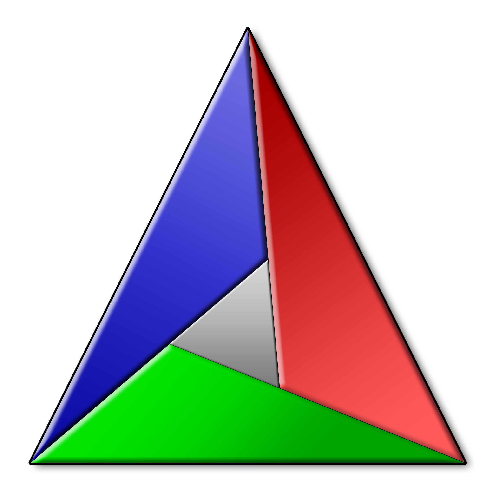
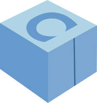

### Hello, I'm Egor! Software engineer.
Software Engineer experienced with embedded systems, cross-platform compilation, software integration and build automation. Solid background in C++ programming, Python scripting, and basics of OpenGL. Currently employed at [Rightware](https://rightware.com/) as a Jr SW Engineer. Tools that I use:

 

Completed university courses can be found on my LinkedIn and Website:

