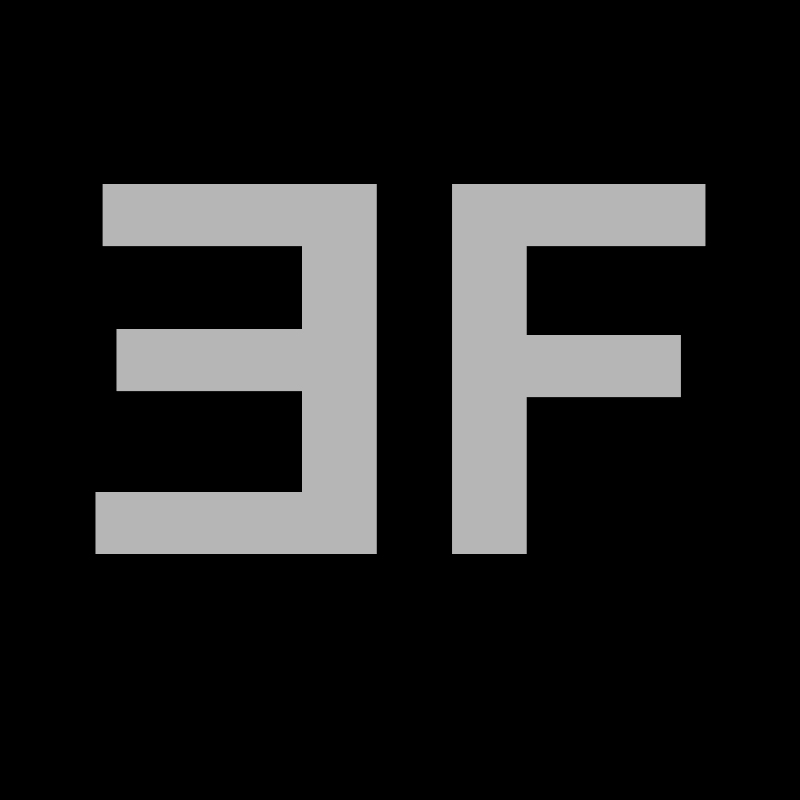

### Hello, I'm Egor! Software engineer.
Degree in Mechanical Engineering and Automation with extensive elective coursework in Programming and Computer Science, completed a Full Stack development and DevOps training programme at [Integrify](https://www.integrify.io/). Solid C++ programming background, experience with embedded systems, basics of OpenGL. Currently work at [Rightware](https://rightware.com/) as a Jr. SW Engineer. Tools that I use:

Completed courses can be found on my LinkedIn and Website:

